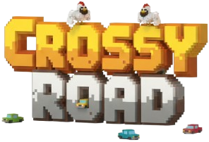

  

Email dei componenti:

* giuliano.manzi@studio.unibo.it

* lorenzo.baldazzi2@studio.unibo.it

* alessio.magnani@studio.unibo.it

* mattia.golinucci2@studio.unibo.it

Il gruppo si pone come obiettivo quello di realizzare una replica del videogioco "Crossy Road" nel quale il giocatore deve manovrare un personaggio e cercare di portarlo al sicuro dall'altro lato della strada. Lungo la strada ci sono ostacoli passivi (alberi, rocce, ecc) e attivi (macchine, treni) che il giocatore deve evitare. Oltre agli ostacoli lungo il percorso il giocatore può raccogliere delle monete che gli consentono di sbloccare nuovi personaggi a fine partita. Il gioco è un endless runner, ovvero va avanti finché il giocatore non perde, senza una fine prestabilita.

Questo gioco è molto popolare grazie alla sua meccanica semplice e intuitiva che però non lo rende banale. E' una versione endless runner del videogioco degli anni 80 Frogger che ha venduto più di 20 milioni di copie nel mondo. Questo progetto ha l'obbiettivo di crearne una versione moderna in Java.

Funzionalità minimali ritenute obbligatorie (realizzabili in circa il 60-70% del tempo a disposizione):

* Controllo del personaggio

* Mappa endless a generazione casuale

* Generazione e movimento casuale degli ostacoli attivi

* Sistema monete/personaggi

* Menù di avvio/pausa

Funzionalità opzionali (a completamento del 100% del tempo a disposizione):

* Generazione casuale degli ostacoli passivi

* Nuovo ostacolo attivo: fiume con tronchi per l'attraversamento

* Sistema di punteggio

* Inserimento power up lungo il percorso

* Salvataggio stato partita

"Challenge" principali:

* E' necessario implementare un game loop

* La GUI richiede molta attenzione in termini di qualità e fluidità

* La necessità di combinare assieme i vari elementi richiede un design attento

Suddivisione di massima del lavoro (con parte significativa del model a ognuno):

* Manzi: generazione della mappa; generazione ostacoli passivi

* Baldazzi: sistema monete/personaggi; menù di avvio/pausa; aggiunta power up; salvataggio stato

* Magnani: gestione e movimento del personaggio; aggiunta fiume

* Golinucci: generazione e movimento ostacoli attivi; sistema di punteggio

# Commands
>In game commands:

- Use W,A,S,D or ↑,←,↓,→ to move the player, use Esc to reach the menu. Step on a coin or a power-up to pick it up.